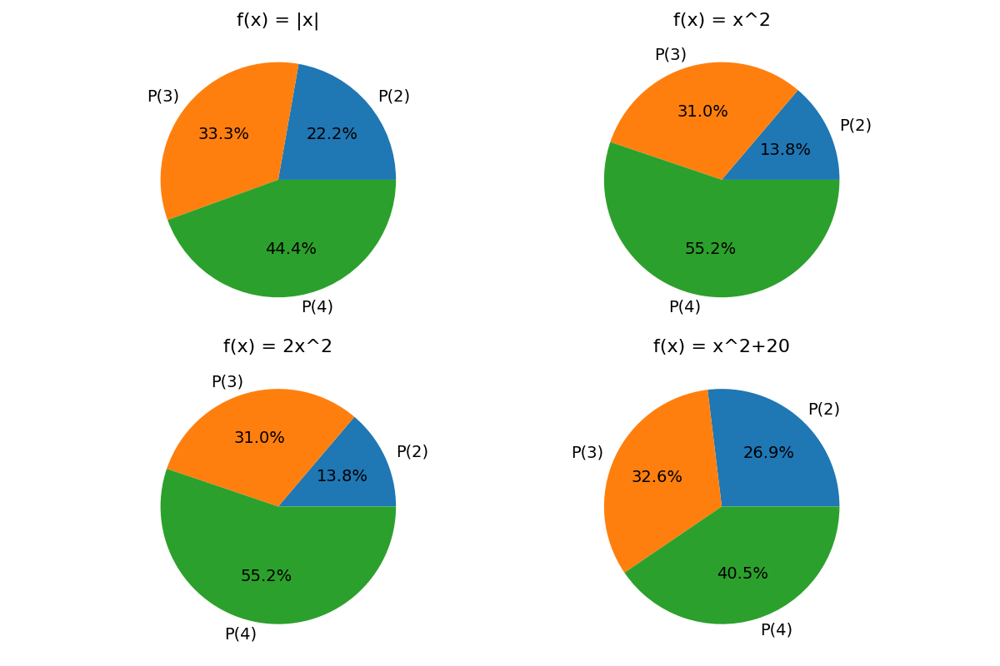

# Assignment 4 

## Part A
1. 1) See table below:
   
| Fitness Function  	| $f(2)$ 	| $f(3)$ 	| $f(4)$ 	| Sum 	| $P(x=2)$                	| $P(x=3)$                	| $P(x=4)$                	|
|-------------------	|--------	|--------	|--------	|-----	|-------------------------	|-------------------------	|-------------------------	|
| $f_1(x) = \|x\|$  	|    2   	|    3   	|    4   	|  9  	|  $\frac{2}{9} = 0.222$  	| $\frac{3}{9} = 0.333$   	| $\frac{4}{9} = 0.444$   	|
| $f_2(x) = x^2$    	|    4   	|    9   	|   16   	|  29 	|  $\frac{4}{29} = 0.138$ 	| $\frac{9}{29} = 0.310$  	| $\frac{16}{29} = 0.552$ 	|
| $f_3(x) = 2x^2$   	|    8   	|   18   	|   32   	|  58 	|  $\frac{8}{58} = 0.138$ 	| $\frac{18}{58} = 0.310$ 	| $\frac{32}{58} = 0.552$ 	|
| $f_4(x) = x^2+20$ 	|   24   	|   29   	|   36   	|  99 	| $\frac{24}{99} = 0.242$ 	| $\frac{29}{99} = 0.293$ 	| $\frac{36}{99} = 0.364$ 	|

Which results in the following pie charts:

1. 2) Linear scaling does not impact the probablities, as the sum is also linearly increased. When adding a constant value to the fitness function, probabilities for lower values increase notably (making them more uniform).

2. 1) The algorithm finds an optimum! It takes a while but in the end it plateaus when all 1's are matched.

2. 2) The fitness fluctuates, as the algorithm randomly generates strings and are always updated. It hovers around 50, which is logical as this is the half of the length. It does not converge to an optimum like before.
   
2. 3) While for individual runs the results may differ, due to pure randomness the first implmeneation may not converge at all. By pure chance, the second implementation may end on a string with only 1's. Overall this will not be the case, using the Law of large numbers we can see the "average" result.

2. 4) ?

## Part B

